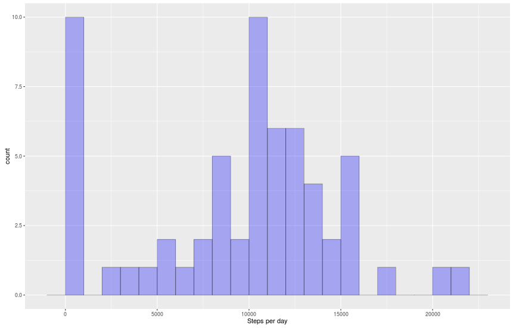
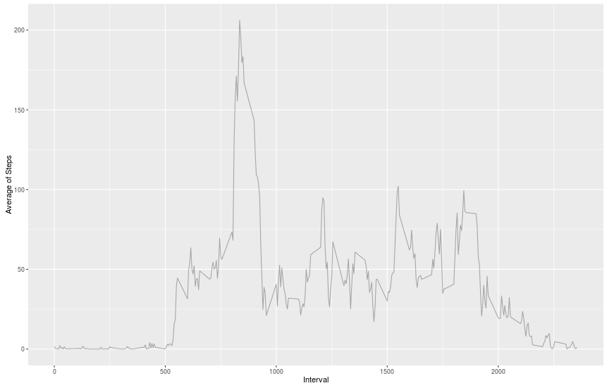
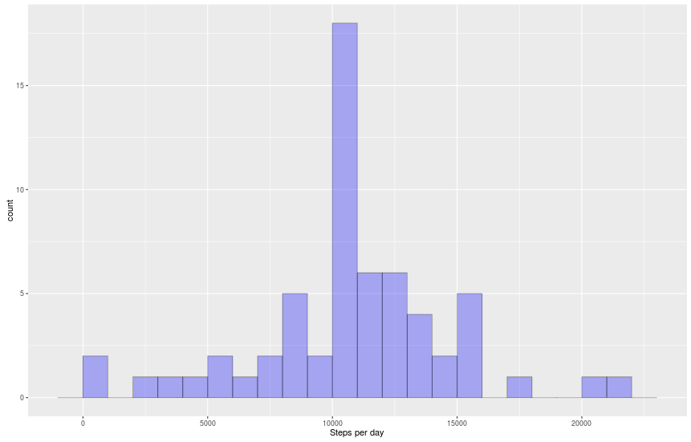
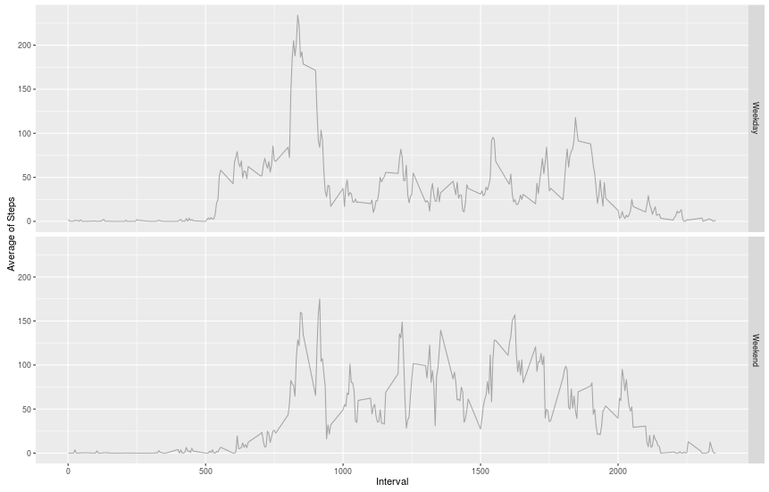

# Reproducible Research: Peer Assessment 1

Initial library load:
```R
library(dplyr)
library(ggplot2)
library(reshape2)
library(lubridate)
```

## Loading and preprocessing the data

```R
dataDirectory <-'data'
dataFile <- file.path(dataDirectory,'activity.csv')
rawDataFile <- 'activity.zip'

#Verify the existence of our data dataDirectory
if(!dir.exists(dataDirectory)){
	dir.create(dataDirectory)
}

if(!file.exists(dataFile) && file.exists(rawDataFile))
	unzip(zipfile=rawDataFile,exdir=dataDirectory)

dta <- read.csv(dataFile,colClasses = c("numeric","Date","numeric"))
```

This should lead to the following structure:

>'data.frame':	17568 obs. of  3 variables:  
> $ steps   : num  NA NA NA NA NA NA NA NA NA NA ...  
> $ date    : Date, format: "2012-10-01" "2012-10-01" "2012-10-01" "2012-10-01"  ...  
> $ interval: num  0 5 10 15 20 25 30 35 40 45 ...  

## What is mean total number of steps taken per day?

```R
#Aggregates steps per day
stepsPerDay <- aggregate(dta$steps, by = list(dta$date), sum, na.rm=TRUE) 
names(stepsPerDay) <- c("Date", "Steps")

#Creates the summary about the data, ignoring NAs
stepsPerDay.summary <- summary(stepsPerDay$Steps)

qplot(Steps, 
      data = stepsPerDay, 
      geom="histogram", 
      xlab = "Steps per day",
      binwidth = 1000,
      fill=I("blue"),
      col=I("black"),
      alpha=I(.3))
```

stepsPerDay.summary:

|Min.	| 1st Qu. | Median | Mean | 3rd Qu. | Max.  | 
|---    |---      |---     |---   |---      |---    |
|     0	|6778	  |10400   |9354  |12810    |21190  |

Histogram




## What is the average daily activity pattern?

```R
#Separetes the data for intervals
intervalMeans <- aggregate(dta$steps, by = list(dta$interval), mean, na.rm=TRUE)
names(intervalMeans)<-c('Interval','Mean')

intervalMedians <- aggregate(dta$steps, by = list(dta$interval), median, na.rm=TRUE)
names(intervalMedians)<-c('Interval','Median')

intevalDta <- merge(intervalMeans,intervalMedians, by = 'Interval')

#If in RStudio, copy this function call to the terminal
qplot(data= intevalDta,
      x= Interval,
      y= Mean,
      geom= 'line', 
      xlab = 'Interval',
      ylab = 'Average of Steps',
      color=I("black"),
      alpha=I(.3))
```

The resulting pattern is demonstrated by the following figure:


To locate the 5-minute interval that contains the maximum number of steps, on average across all the days in the dataset, we can simply filter all data frame.

```R
#Search for all intervals where the average of steps is equal to the maximum average value.
filter(intevalDta, Mean==max(Mean))
```
Interval | Mean    | Median
---      |---      | ---
835      |206.1698 |    19

## Imputing missing values

### The total number of missing values in the dataset

There are 2304 intervals with NAs steps.

It was calculated by the following R code:
```R
#The total number of missing values in the dataset
countNA <- sum(is.na(dta$steps))
```

To study the effects of replacing the NAs by means, on the same interval, we used the followinf script:

```R
#Replace all NAs with the mean of steps on a inteval
dtaNoNAs <- dta %>% mutate(
	steps = ifelse(
		is.na(steps),
		tapply(dtaNoNAs$steps, dtaNoNAs$interval, mean, na.rm = TRUE),
		steps)
	)


#Aggregates steps per day
stepsPerDay <- aggregate(dtaNoNAs$steps, by = list(dtaNoNAs$date), sum, na.rm=TRUE) 
names(stepsPerDay) <- c("Date", "Steps")

#Creates the summary about the data, ignoring NAs
stepsPerDay.summary <- summary(stepsPerDay$Steps)

#If in RStudio, copy this function call to the terminal
qplot(Steps, 
      data = stepsPerDay, 
      geom="histogram", 
      xlab = "Steps per day",
      binwidth = 1000,
      fill=I("blue"),
      col=I("black"),
      alpha=I(.3))
```
The new histogram is then:



###Summary:
```R
summary(dtaNoNAs$steps)
```
Dataset |Min.	| 1st Qu. | Median | Mean | 3rd Qu. | Max.  | 
|---    |---    |---      |---     |---   |---      |---    |
Old     |     0	|6778	  |10400   |9354  |12810    | 21190 |
New	|0.00   | 0.00    |0.00    |37.39 |27.00    | 806.00| 

## Are there differences in activity patterns between weekdays and weekends?

Finally, to compare the patterns on weekdays and weekends:

```R
#Creates a weekend/weekday flag
dtaNoNAs <- dtaNoNAs %>% mutate(weekend = ifelse(wday(date)==1|wday(date)==7,'Weekend','Weekday'))

#Separetes the data for intervals
intervalMeans <- aggregate(dtaNoNAs$steps, by = list(dtaNoNAs$weekend,dtaNoNAs$interval), mean,na.rm=TRUE)
names(intervalMeans) <- c('Weekend','Interval','Mean')


#If in RStudio, copy this function call to the terminal
qplot(data= intervalMeans,
      x= Interval,
      y= Mean,
      geom= 'line', 
      xlab = 'Interval',
      ylab = 'Average of Steps',
      color=I("black"),
      alpha=I(.3),
      facets = Weekend~.)
```
The comparative histogram is then:


